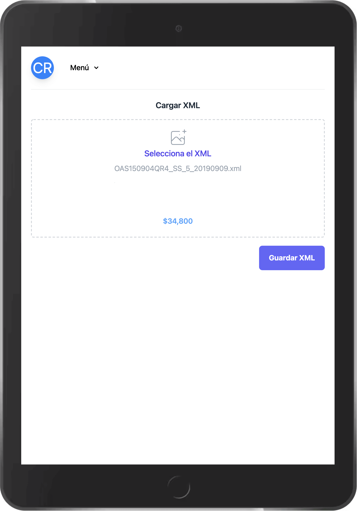
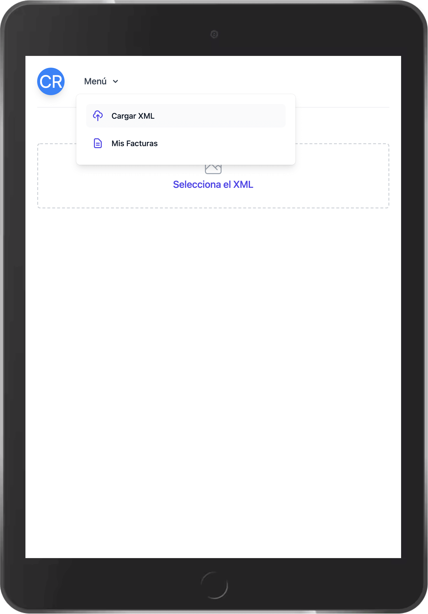
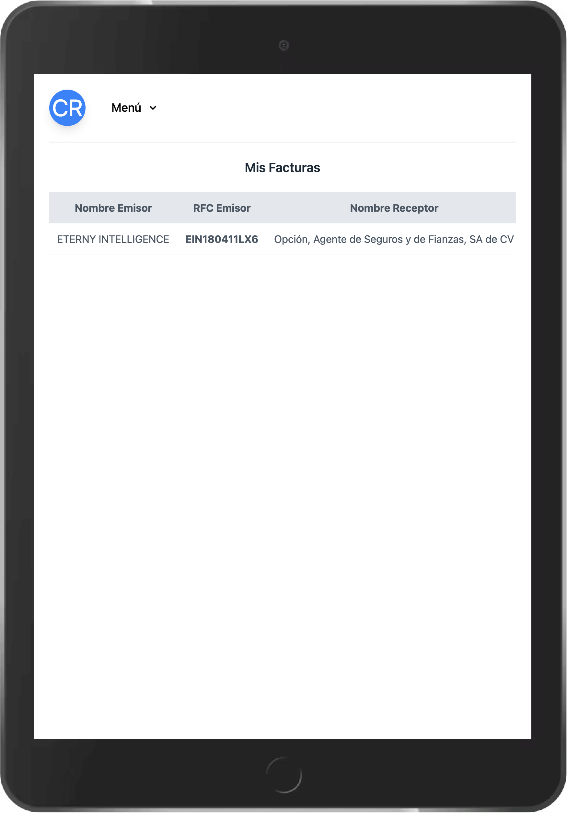

<p align="center">
  <h3 align="center">How to use VueJs, Django, Django Rest Framework, Postgres and  Nginx</h3>
  <h6 align="center">Cristian Yosafat Hernández Ruiz</h6>
</p>
<p align="center">
  
</p>
<br>

# FrontEnd (VueJS) Docker Compose

## You need to run FrontEnd and BackEnd CLI

```sh
cd front && docker-compose up
```

Open [http://localhost:8081](http://localhost:8081) with your browser to see the app


# BackEnd (Django, Django Rest Framework, Postgres, Nginx) Docker Compose

```sh
cd back && docker-compose up
```

Api BackEnd  [http://localhost:1337](http://localhost:1337)


### Debug FrontEnd
```sh
yarn serve
```

### Debug BackEnd
```sh
python3 manage.py makemigrations app
python3 manage.py migrate app
python3 manage.py runserver

docker-compose run app python3 manage.py makemigrations app
docker-compose run app python3 manage.py migrate app
docker-compose up
```

<p align="center">
  <br>
  

  
</p>
